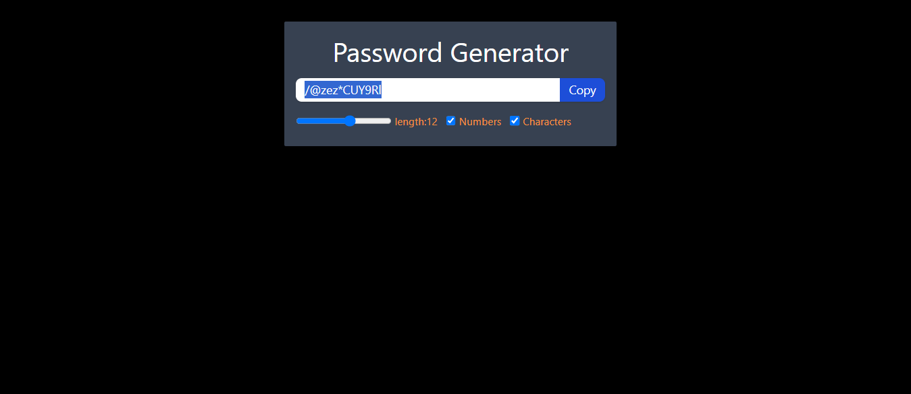

# Password Generator App

This project is a simple password generator built using React.

## Features

- **Password Generation:** Generates random passwords based on user preferences.
- **Password Criteria:** Allows users to select password length and include options like numbers, and special characters.
- **Copy to Clipboard:** Enables users to copy generated passwords to the clipboard with a single click.

## Technologies Used

- React
- JavaScript (ES6+)
- Tailwind Css

## Usage

- Select desired password length and criteria.
- Click "Generate Password" to create a new password.
- Click "Copy to Clipboard" to copy the generated password.

## Screenshots

